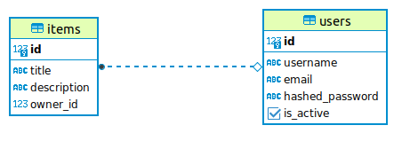
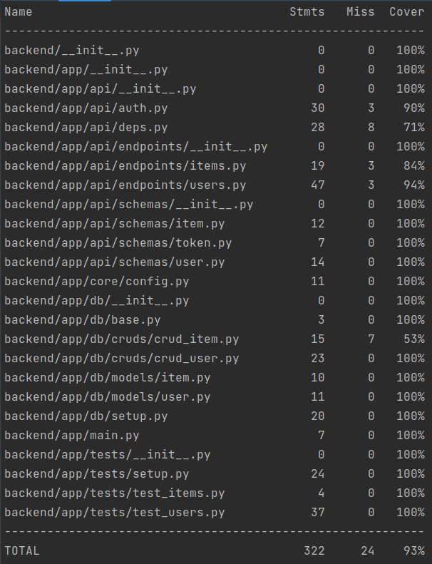

# FastAPI Boilerplate

FastAPI Boilerplate - готовая основа для быстрой сборки backend-сервисов на основе `FastAPI`,  Авторизация - `JWT`. База данных - `PostgreSQL`. Миграции - `Alembic`. ORM - `SQLAlchemy v.2.0`. Валидация - `Pydantic`. Зависимости - `Poetry`. Тестирование - `PyTest`. Линтеры - `Black`, `Flake8` .

## Описание схемы БД

База данных содержит 2 модели: `User`(Пользователь), `Item`(Предмет). Ниже представлена графическая схема моделей и их взаимосвязей.



## Краткая документация API

Работа с моделями БД осуществляется по следующим эндпоинтам:

Method | HTTP request                    | Description
------------- |---------------------------------| -------------
[**create_user**] | **POST** users/                 | Регистрация нового пользователя
[**read_users**] | **GET** users/                  | Извлечение списка всех пользователей.
[**login**] | **POST** /token                 |  Авторизация пользователя.
[**read_users_me**] | **GET** /users/me               | Извлечение текущего пользователя.
[**read_user**] | **GET** /users/{user_id}      | Извлечение пользователя по `ID`.
[**delete_user**] | **GET** /users/{user_id}     | Удаление пользователя по `ID`.
[**create_item_for_user**] | **POST** /users/{user_id}/items | Добавление нового предмета.
[**read_user_items**] | **GET** /users/me/items         | Извлечение предметов текущего пользователя.

Исчерпывающую информацию по работе API можно получить после запуска по адресу http://127.0.0.1:8000/
Документация на основе Swagger, в соответствии со стандартом OpenAPI.

## Тестирование

Код проекта был протестирован библиотекой PyTest. Покрытие кода тестами составило 93%



## Инструкция по установке без Docker

### 1.1 Подготовка базы данных

1.1.1 Обновляете систему, устанавливаете и запускаете Postgres
```sh
sudo apt update
sudo apt install postgresql-15
```

1.1.2 Заходите в аккаунт Postgres, открываете терминал Postgres, уставливаете и запускаете Postgres
```sh
sudo -i -u postgres

psql
```
1.1.3 Создаете базу данных
```sh
CREATE DATABASE <DB_NAME>;
\q
```

### 1.2 Запуск проекта

1.2.1 Клонируете репозиторий
```sh
git clone https://github.com/XanderMoroz/boilerplate_fastapi.git
```
1.2.2 Устанавливаете, виртуальное окружение:
```sh
poetry shell
```
1.2.3 Устанавливаете зависимости проекта:
```sh
pip install -r requirements.txt
```
1.2.4 Создаете файл `.env` и заполняете его по примеру файла `.env.template`

1.2.5 Применяете миграции в базе данных
```sh
alembic upgrade head
```
1.2.6 Запускаете авто-тесты:
```sh
poetry run pytest --cov
```
1.2.7 Запускаете проект:
```sh
uvicorn app.main:app --reload
```
1.2.8 Документация доступна по адресу:
```sh
http://127.0.0.1:8000/
```
### 2.1 Запуск проекта с Doker
2.1.1 Создаете файл .env и заполняете его по примеру файла .env.template
2.1.2 Создаете и запускаете контейтер через терминал:
```sh
sudo docker-compose up -d
```
2.1.3 Применяете миграции в базе данных:
```sh
sudo docker exec -i -t fast_api_boiler alembic upgrade head
```
2.1.4 Сервис доступен по адресу: http://0.0.0.0:8000/
